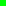
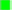
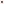

# Screen capture compression color artifacts

> Note: I've since changed the algorithm to always use a single pixel marker
only as I was able to make that work in all of Firefox, Safari and Chrome.

The `getDisplayMedia` stream is compressed and the compression causes colors to
change differently in different browsers. To avoid having to raise `tolerance`
too high, I checked how the compression affects the pure color at different
marker size mid-points.

I use the knowledge of the marker size and browser combination we're dealing
with to tell the algorithm to use a different color than the pure red or lime so
we don't have to raise the `tolerance` value high (which increase the false
positive rate and thus is computationally more expensive).

I was able to build a dataset of what colors I should compare against at various
marker sizes instead of pure red and lime so that I can keep the `tolerance`
value low, not get false positives and be more likely to find the markers. This
also enables the usage of reliable single-pixel markers in all supported
browsers, which was previously not possible with a more generic algorithm.

| Marker@scale | Red midpoint                      | Lime midpoint                        |
|--------------|-----------------------------------|--------------------------------------|
| Firefox 1@2  |  253 0 0  |  0 255 2    |
| Firefox 2@2  |  253 0 0  |  0 255 2    |
| Firefox 3@2  |  253 0 0  |  0 255 2    |
| Firefox 4@2  |  253 0 0  |  0 255 2    |
| Firefox 5@2  |  253 0 0  |  0 255 2    |
| Safari 1@2   |  151 28 26 |  99 215 98   |
| Safari 2@2   |  255 0 0   |  0 255 0     |
| Safari 3@2   |  255 0 0   |  0 255 0     |
| Safari 4@2   |  255 0 0   |  0 255 0     |
| Safari 5@2   |  255 0 0   |  0 255 0     |
| Chrome 1@1   |  124 97 96 |  179 197 174 |
| Chrome 2@1   |  138 91 88 |  161 211 147 |
| Chrome 3@1   |  206 64 51 |  131 235 103 |
| Chrome 4@1   |  206 64 51 |  122 241 91  |
| Chrome 5@1   |  236 51 35 |  113 249 77  |

In Firefox, the colors are nicely stable and no adjustment is needed with only
low tolerance of ~5 compared to pure is needed even for single-pixel markers.

In Safari, there needs to be an exception for the single-pixel marker, but above
that, the color is also stable and very low tolerance is needed compared to pure
color.

In Chrome, the colors are very washed out and change drastically with the size
of the marker even up to size 5. For Chrome, I have encoded the whole array of
the five possible adjustments. This enabled me to keep the `tolerance` value low
and results in reliable marker lookup even for a single-pixel marker.

How I get the images in the table:

1. Set the app to debug mode using `const autoCrop = false;`
2. Configure the desired marker size using `--marker-size` in CSS
3. Do a full screen capture and wait for the `canvas` to show up
4. Drag and then click on the top-left corner of the first marker area
5. Drag and then click on the bottom-right corner of the first marker area
6. Give the marker a name in the prompt: `browser-size-scale-red` (w/o `.png`)
7. Drag and then click on the top-left corner of the second marker area
8. Drag and then click on the bottom-right corner of the second marker area
9. Give the marker a name in the prompt: `browser-size-scale-lime` (w/o `.png`)
10. Add the image to the above list
