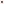
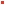
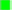

# Selfie

Selfie is a JavaScript library for taking screenshots of own page. It uses the
[`getDisplayMedia`](https://developer.mozilla.org/en-US/docs/Web/API/MediaDevices/getDisplayMedia)
API combined with a little user hand-holding to achieve that.

This is an alternative method to [`html2canvas`](https://github.com/niklasvh/html2canvas).

There is a [early draft of a proposal](https://eladalon1983.github.io/mediacapture-screenshot)
to introduce a native browser API for capturing self-screenshots. It is in its
early stages and there is no implementation yet that I'm aware of.

## Demo

https://tomashubelbauer.github.io/selfie

## Usage

### To capture someone else's page using DevTools

```js
const { default: selfie } = await import('https://tomashubelbauer.github.io/selfie/selfie.js');
selfie();
```

The extra step of clicking the button is required as the `getDisplayMedia` API
needs to be called from a user gesture.

### To capture your own page

Install statically using a `script` tag:

```html
<script src="https://tomashubelbauer.github.io/selfie/snap.js"></script>
```

Install statically using ESM `import`:

```js
import snap from 'https://tomashubelbauer.github.io/selfie/snap.js';
```

Install dynamically using ESM `import`:

```js
const { default: snap } = await import('https://tomashubelbauer.github.io/selfie/snap.js');
```

Call the `snap` function in a way that includes user interaction (e.g. a button)
as the user interaction is required for the `getDisplayMedia` API to be used and
use the resulting `canvas`.

```js
button.addEventListener('click', async () => document.body.append(await snap()));
```

### To capture a portion of your own page

Display two markers, a top-left red one and a bottom-right lime one. Calculate
the dimensions of the rectangle defined by them. Plug the resulting width and
height into the `scan` function. The markers can be as small as 1x1 px, but in
practice due to image compression color artifacts the `getDisplayMedia` API
suffers from, an area of 5x5 px is best for each marker. Surround each marker
with a white border to help prevent the color artifact from surrounding pixels.

Install statically using a `script` tag:

```html
<script src="https://tomashubelbauer.github.io/selfie/snap.js"></script>
<script src="https://tomashubelbauer.github.io/selfie/scan.js"></script>
```

Install statically using ESM `import`:

```js
import snap from 'https://tomashubelbauer.github.io/selfie/snap.js';
import scan from 'https://tomashubelbauer.github.io/selfie/scan.js';
```

Install dynamically using ESM `import`:

```js
const { default: snap } = await import('https://tomashubelbauer.github.io/selfie/snap.js');
const { default: scan } = await import('https://tomashubelbauer.github.io/selfie/scan.js');
```

Call the `snap` function in a way that includes user interaction (e.g. a button)
as the user interaction is required for the `getDisplayMedia` API to be used and
pass the resulting `canvas` as well as the above described dimensions into the
`scan` function which will return the x and y coordinates of the crop in the
provided `canvas` (and you already have the dimensions):

```js
button.addEventListener('click', async () => {
  document.body.append(scan(await snap(), 5 /* color tolerance */, width, height));
});
```

You can use the `crop` function provided by Selfie to crop the canvas to the
found area, just reference `crop.js` the same way you do the other scripts:

```js
button.addEventListener('click', async () => {
  document.body.append(crop(scan(await snap(), 5 /* color tolerance */, width, height)));
});
```

## Development

Run using `npx serve .` (http://localhost:5000) instead of off `file` protocol.
This is needed for ESM and canvas CORS to run correctly.

### How it works

Capturing a screenshot of whatever the user selects in the browser UI when asked
is done by using the `getDisplayMedia` API which returns a stream which we stop
right after we capture its first frame.

Capturing a particular area is done by toggling two markers described in the
Usage section above while taking the screenshot. Afterwards, an algorithm is
used to find the location of the main marker in the screenshot and the knowledge
of the offset between the two markers provides us with all the information we
need to crop the original screenshot down to just the desired area.

The algorithm works by assuming:

- The marked area will be rectangular
- The marked area will not be rotated or scaled, only translated
- The marked area will be there and if it can't find it, that's an error
- The marked area will have a known, correct size (provided by the caller)
- Both the lime top-left marker and the red bottom-right marked will be visible
- The markers will be apart the correct distance horizontally and vertically


## Support

I've tested the library works in Mozilla Firefox and Google Chrome. I've also
tested Safari. In macOS Safari, the user is not asked for a window to select,
the entire screen is shared immediately. In iOS Safari, `getDisplayMedia` is not
supported.

## Notes

### Multiple rendering implementations

If you want to use Selfie in your own web application to take screenshots of it
or a portion of it, one recommendation which applies in some (but not all) cases
is to instead consider introducing two rendering methods for the part of your
application you are interested in capturing.

Most likely you are going to want to make those a DOM renderer (for your normal
uses) and a `canvas`-based renderer for the purposes of calling `toDataURL` on
the `canvas` and obtaining the screenshot of the area of interest.

There is a risk of the two implementations going out of sync, making the capture
untrue to original, and the complexity of this isn't insignificant, but it may
be worth it for the hands-off-ness of the solution.

### Title suffix for easier tab location

I tried suffixing `document.title` in order to make the tab stand out in the
window and tab picker UIs of the browsers, but it only worked on Chrome, not in
Firefox (it seems to remember the titles as they are on page load), so I ditched
it.

### Testing with `getUserMedia`

Replacing `getDisplayMedia` with `getUserMedia` for testing or adjusting the
library to take actual selfies and not screenshots will not work by itself.
Web cams take time to adjust exposure and white balance, so even if the first
frame of the video is available after `await video.play()`, you probably do not
want to use it. Use `await new Promise(resolve => setTimeout(resolve, 100))` to
give the web cam time to adjust the picture and then proceed. Without this, the
first frame usually comes out dark, almost completely black.

### Display scaling

By default, Firefox and Safari return Retina scaled stream whereas Chrome does
not.

`track.getCapabilities().max.height / track.getSettings().height` will not work
in Firefox due to its lack of support for `getCapabilities`. `screen.width` and
`screen.height` comparison to track dimensions will not work where the whole
screen is not being shared. `window.devicePixelRatio` will not work because
Chrome returns 2 for it like others but its stream is not scaled.

It is possible to force non-scaled stream by setting `video.width` constraint to
`screen.width` (which is unscaled), but I'd rather check two possible scales
than to lose the Retina resolution.

## To-Do

### Improve the detection algorithm to be more flexible

Change the size constraint to not be the exact size, but a minimal and maximal
size range, both optional ranging from zero to current screen size. The called
then can provide a guesstimate (or not) and the algorithm performance is
proportional to the breadth of the possible sweep sizes within the size range.

This is intended to be used with things like CSS outline with relative units or
box model shenanigans where the markers might be slightly offset. In this case
the marked container's dimension could be passed it with some size tolerance.

- [ ] Implement the option to specify a size range instead of size value
- [ ] Default the size range to the marker size if not provided explicitly

### Check for the marker colors as well as known browser artifacted colors

The `getDisplayMedia` stream is compressed and the compression causes colors to
change differently in different browsers. To avoid having to raise `tolerance`
too high, let's check multiple variations of each color for the tolerance:

- Browser marker@scale red: 255, 0, 0
- Browser marker@scale lime: 0, 255, 0
- Firefox 1×1@2 red: 
- Firefox 1×1@2 lime: 
- Firefox 2×2@2 red: 
- Firefox 2×2@2 lime: 
- Firefox 3×3@2 red: 
- Firefox 3×3@2 lime: 
- Firefox 4×4@2 red: 
- Firefox 4×4@2 lime: 
- Firefox 5×5@2 red: 
- Firefox 5×5@2 lime: 
- Chrome 1×1@2 red: 
- Chrome 1×1@2 lime: 
- Chrome 2×2@2 red: 
- Chrome 2×2@2 lime: 
- Chrome 3×3@2 red: 
- Chrome 3×3@2 lime: 
- Chrome 4×4@2 red: 
- Chrome 4×4@2 lime: 
- Chrome 5×5@2 red: 
- Chrome 5×5@2 lime: 
- Safari 1×1@2 red: 
- Safari 1×1@2 lime: 
- Safari 2×2@2 red: 
- Safari 2×2@2 lime: 
- Safari 3×3@2 red: 
- Safari 3×3@2 lime: 
- Safari 4×4@2 red: 
- Safari 4×4@2 lime: 
- Safari 5×5@2 red: 
- Safari 5×5@2 lime: 

How to get these images:

1. Set the app to debug mode using `const autoCrop = false;`
2. Configure the desired marker size using `--marker-size` in CSS
3. Do a full screen capture and wait for the `canvas` to show up
4. Drag and then click on the top-left corner of the first marker area
5. Drag and then click on the bottom-right corner of the first marker area
6. Give the marker a name in the prompt: `browser-size-scale-red` (w/o `.png`)
7. Drag and then click on the top-left corner of the second marker area
8. Drag and then click on the bottom-right corner of the second marker area
9. Give the marker a name in the prompt: `browser-size-scale-lime` (w/o `.png`)
10. Add the image to the above list

The idea is to find the colors the red and lime are compressed into through the
`getDisplayMedia` compression and use those alongside the pure red and pure lime
in the algorithm. We could also do browser-detection to only feed the given
browser its identified compressed colors.

- [ ] Pool the main color from each of the collected artifact samples/browser
- [ ] Document how static the color artifacting is and if it will be usable
- [ ] Update the algorithm to be able to work with a pool of color candidates

If this works as I'm hoping it might, it should be possible to use this data to
always have a single-pixel marker and low or no color tolerance.

### Use `window.devicePixelRatio` as the first scale to try in the scale array

Have an array of `window.devicePixelRatio` and one unless it already is one in
which case try only the normal scale in `snap.js`.

### Configure the media stream constraints better once they are well supported

All of these are only in Opera right now!

https://developer.mozilla.org/en-US/docs/Web/API/MediaTrackConstraints/cursor

Disable cursor because we are not waiting for the user to point anywhere.

https://developer.mozilla.org/en-US/docs/Web/API/MediaTrackConstraints/displaySurface

Consider preselecting `browser` so we automatically get out current tab and do
not have to ask the user to select it. We'd still do the auto-crop but just to
get rid of the browser UI and handle Safari which still returns full screen.

https://developer.mozilla.org/en-US/docs/Web/API/MediaTrackConstraints/logicalSurface

Not sure what this is completely, so check by checking what I get for the
various options provided by the browser:

https://developer.mozilla.org/en-US/docs/Web/API/MediaTrackConstraints/logicalSurface#usage_notes

### Fix the artifact tool color indicator label displaying nonsense when panned
